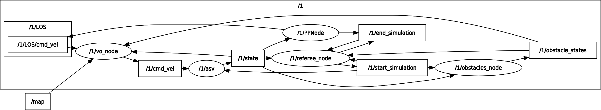

# The Planner Tester Package
## Installation
This package was coded on Ubuntu 20.04 LTS with ROS Noetic. It wouldn't work on previous versions of ROS because it uses Python 3.
Here are the steps to take to install it from scratch, starting from a plain Ubuntu 20.04 distribution.

### ROS Installation
The first step is to enable access to the repositories universe, multiverse and restricted if it not already. This needs to be typed in the terminal :
```
sudo add-apt-repository universe
sudo add-apt-repository multiverse
sudo add-apt-repository restricted
```
Then, we need to add the key to the ROS distribution :
```
sudo sh -c 'echo "deb http://packages.ros.org/ros/ubuntu $(lsb_release -sc) main" > /etc/apt/sources.list.d/ros-latest.list'
curl -s https://raw.githubusercontent.com/ros/rosdistro/master/ros.asc | sudo apt-key add -
```
Before launching the installation, check that all your packages are up to date :
```
sudo apt-get update && sudo apt-get upgrade
```
Finally, launch the installation (here we used the full version) :
```
sudo apt install ros-noetic-desktop-full
```
Before continuing, don't forget to source the ROS setup (**this needs to be done each time a new terminal is opened**) :
```
source /opt/ros/noetic/setup.bash
```
### Package Installation
Before installing the main package, we need to install the additional depedencies (some more may be necessary depending on your configuration) :
```
sudo apt install ros-noetic-tf2
sudo apt install libeigen3-dev
sudo apt install python3-pip
pip3 install pandas
pip3 install openpyxl
pip3 install scipy
pip3 install datetime
```
Finally, you need to be located in the directory where you want to install your ROS workspace, and proceed :
```
mkdir -p workspace/src/
cd workspace/src/
git clone https://github.com/Straccia11/seaowl.git
cd ..
catkin_make
```
(**Some problems may occur because of the package asv_msgs**)

You will need to source the package before starting to use it and **everytime you open a new terminal**. From the location of your workspace :
```
source devel/setup.bash
```
## Run

- Process manuel
- Process automatique
- Multiprocess

### Get Started
To launch a graphic user interface allowing to set easily the parameters, type in the terminal :
```
roscd asv_system
python3 executable5.py
```
### Launch Simulations
There are two ways of properly using the package : with launchfiles or with python APIs.

- Launchfiles are located in `asv_system/launch` and can be launched with
```
roslaunch asv_system name_of_the_launchfile.launch
```
- APIs are the python files located in `asv_system` and need to be executed by Python 3
```
roscd asv_system
python3 executable_file.py
```

The parameters can either be set manually in the launch files if the simulation is launched that way, either be entered in a graphic interface for `executable5.py`, or be set in an Excel or YAML file put in `asv_system/param/` and executed respectively with `executable6.py` or `executable9.py`.

### Output
When a simulation is over, an input file and an output file (both plain text files) are respectively created in `asv_system/input/` and `asv_system/output/`, named after a serial number concatenating the year, month, day, hour, minute and second the simulation was launched. These informations can be plotted using `asv_system/graph_drawer.py`


## Content

### Launch Files and Executables

***
Preciser inputs et outputs

### Packages
This package contains:
+ `asv_ctrl_vo`: an implementation of the "Velocity Obstacle" algorithm for
collision avoidance
+ `asv_global_planner`: an implementation of the "A Star" algorithm for
collision avoidance
+ `asv_map_processing`: a package meant for implementing the inflation of static obstacles
+ `asv_msgs`: message types used in the system
+ `asv_obstacle_tracker`: package that acts as a "black box", providing
information about the states (and possibly metadata) that a collision avoidance
system can subscribe to. _It does not actually track obstacles._ It is also
possible to simulate the addition of sensor noise using this package. It also contains a node that directly simulate the obstacles if their trajectory is straight
+ `asv_path_trackers`: implements the (Integral) Line of Sight (LOS) method and
a simple pure pursuit scheme for path following
+ `asv_referee`: package that contains all the node that contributes to the coordination and evaluation of the behavior of the ASV
+ `asv_simulator`: simulates a nonlinear 3DOF surface vessel
+ `state_estimator`: unfinished package for estimating the ASV pose given GPS
and IMU data
+ `asv_system`: metapackage with launch files and more

### Nodes

| Package | Node(s) |
| --- | --- |
| `asv_referee` | `referee_node`, `reaper_node` |
| `asv_path_trackers` | `LOS_node`, `PP_node` |
| `asv_obstacle_trackers` | `obstacle_tracker_node`  |
| `asv_simulator` | `simulator_node` |
| `asv_global_planner` | `global_planner_node` |
| `asv_ctrl_vo` | `ctrl_vo_node` |
| `asv_map_processing` | `map_processing_node` |

#### Main Nodes (required)
+ `simulator_node`: simulates the vessel
+ `LOS_node` / `PP_node`: implement a path tracker algorithm (either _Line Of Sight_ or _Pure Pursuit_) over an array of waypoints (the difference between the two algorithms can be found in  [Thomas Stenersen's thesis](https://ntnuopen.ntnu.no/ntnu-xmlui/bitstream/handle/11250/2352498/12747_FULLTEXT.pdf?sequence=1&isAllowed=y))
+ `obstacle_tracker_node` / `obstacle_simplified_node`: transmits the positions and velocities of the other ships to the ASV, _`obstacle_simplified_node`_ also simulates the obstacles if their trajectories are straight and their velocities constant (otherwise _`obstacle_tracker_node`_ needs them to be independantly simulated with a _`simulator_node`_ for each)

#### Additional Important Nodes
+ `referee_node`: calculates all the performance indicators and etablish the times of beginning and end of the simulation. Can be set to _required_ in the launch file to automatically close the program at the end of the simulation (only for single processing)
+ `reaper_node`: in case of multiprocessing, kills all the nodes once they are all finished. Requires _`referee_node`_
+ `global_planner_node`: implements the global_planner, the one included is an _A Star_ planner but an other one can be integrated easily
+ `ctrl_vo_node`: implements the local planner in this case a _Velocity Obstacle_ planner. Another one can be integrated, but it would need to change the file architecture a bit
+ `map_processing_node`: if the simulation contains static obstacles (basically a map), creates a security margin with them by implementing obstacle inflation. Requires the _`map_server`_ node, which is included in the default ROS packages


#### Deprecated Nodes (for information)
+ `clock_node`: meant to accerate the simulation thus shortening its duration. Caused a degradation of the behavior of the algorithms and was then left out
+ `state_simulator_node`: incomplete implementation of the estimation of the ASV pose via GPS
+ `obstacle_tracker_nema_node`: can simulate and track the obstacles simulated by the emission of AIS signals via an UDP port. Was meant to be used with the software _Nema Studio_ but this possibility was left out

### Main Topics
_The **Architecture** part describes where each node publish and subscribe._

The topics are often included in diverse namespaces indicating the opus and/or vessel related to the specific topic.

- `/state` (type ): real pose and twist of a vessel
- `/LOS/cmd_vel / /PP/cmd_vel`, `/cmd_vel` (type ): twist of a vesset respectively calculated by the path tracker and the local planner  
- `/obstacle_states` (type StateArray):
- `/end_simulation`, `/start_simulation` (type _Empty_): when a message is published, signal respectively the end or the beginning of the simulation (used to synchronize the nodes and automate the execution of the successive opuses)
- `/map`, `/processed_map`, `/localmap` (optionnal, type _Occupancy Grid_): if a static map is set in the parameters, `/map` is its conversion into an occupancy grid, `/processed_map` is the implementation of the inflated static obstacles and `/local_map` is a short-ranged non-static version of the map used by the local planner  

### Additional Message Types

All the message types specific to this package are detailed in the sub-package`/asv_msgs`.

### Utility Scripts

- `clear.sh`: removes the input and output or either a specific simulation or all the scripts
- `current_opus.sh`: indicates the maximum opus of the latest simulation  
- `kill.sh`: kills all processes related to the package (to use when a simulation or several are running in the background)               
- `concatenate.sh`: (**NOT YET WRITTEN**) concatenates two output and remove all the duplicate opuses  
- `graph_drawer.py`: opens a graphical interface allowing to plot data from the results of a specific simulation
- `launch_background.sh`: launches `executable9.py` / `executable9Adrien.py` in the backgound and write the output and errors in the directory `log/` (**the parameters are in executable9**)
- `watch_cpu.py`: gives information about the CPUs and memory activity over a certain periiod of time (meant to determine how many processes can be launched simultaneously)
- `config.sh`: configures a new machine to be able to use the package (**not meant to be executed as a whole script but line by line**)      
- `is_running.sh`: indicates if the process is still running (**not very trustworthy**)    
- `rename.sh`: renames the input and output of a specific simulation (by default the latest)


## Architecture
### Nodes and Topics

Here is the node graph of a case where there is a local planner but no global planner and `obstacle_simplified_node` is used :

***
Here is another where there is a map, a local planner, a global planner and an obstacle ship simulated with `asv_simulator_node` :

***
### File architecture
```
.
├── asv_ctrl_vo
│   ├── include
│   │   └── ...
│   └── src
│       ├── asv_ctrl_vo.cpp
│       └── asv_ctrl_vo_node.cpp
├── asv_global_planner
│   ├── include
│   │   └── ...
│   └── src
│       ├── asv_a_star.cpp
│       ├── asv_global_planner.cpp
│       └── asv_global_planner_node.cpp
├── asv_map_processing
│   ├── include
│   │   └── ...
│   └── src
│       └── asv_map_processing_node.cpp
├── asv_msgs
│   ├── msg
│   │   ├── Path.msg
│   │   ├── ShipMetaData.msg
│   │   ├── StateArray.msg
│   │   ├── State.msg
│   │   └── Waypoint2D.msg
├── asv_obstacle_tracker
│   ├── launch
│   │   ├── default.launch
│   │   ├── nema.launch
│   │   ├── obst_simplified2.launch
│   │   ├── obst_simplified.launch
│   │   └── simple.launch
│   ├── nodes
│   │   ├── crossLaneObstNode.py
│   │   ├── obstacles_simplified_node.py
│   │   ├── obstacle_tracker_nema_node.py
│   │   └── obstacle_tracker_node.py
├── asv_path_trackers
│   ├── nodes
│   │   ├── asv_ctrl_los_node_obstacles.py
│   │   ├── asv_ctrl_los_node.py
│   │   ├── asv_ctrl_pp_node.py
│   │   ├── utils.py
│   │   └── utils.pyc
├── asv_referee
│   ├── nodes
│   │   ├── asv_clock_node.py
│   │   ├── asv_reaper_node.py
│   │   ├── asv_referee_node2.py
│   │   └── asv_referee_node.py
├── asv_simulator
│   ├── config
│   │   ├── parameters
│   │   │   ├── viknes2.yaml
│   │   │   └── viknes.yaml
│   │   └── waypoints
│   │       ├── asv_head_on_and_crossing.yaml
│   │       └── ...
│   ├── include
│   │   └── ...
│   ├── launch
│   │   ├── default.launch
│   │   ├── test2.launch
│   │   ├── test.launch
│   │   └── test_obst.launch
│   ├── nodes
│   │   ├── data_publisher.py
│   │   ├── fake_asv.py
│   │   ├── meshpublisher.py
│   │   ├── rlog011.csv
│   │   ├── teleop_joy.py
│   │   ├── utils.py
│   │   └── vessel.py
│   └── src
│       ├── asv_simulator.cpp
│       ├── asv_simulator_node.cpp
│       └── wave_filter.cpp
├── asv_state_estimator
│   ├── nodes
│   │   ├── asv_state_estimator.py
│   │   └── convert_stuff.py
├── asv_system
│   ├── config
│   │   ├── maps
│   │   │   ├── big_block.png
│   │   │   ├── big_block.yaml
│   │   │   └── ...
│   │   ├── param
│   │   │   ├── param.yaml
│   │   │   ├── param.xlsx
│   │   │   └── ...
│   ├── executable1.py
│   ├── ...
│   ├── graph_drawer.py
│   ├── input
│   │   ├── 210801230453.txt
│   │   └── ...
│   ├── launch
│   │   ├── chenal.launch
│   │   └── ...
│   ├── log
│   │   ├── nohup.out
│   │   └── nohup.err
│   ├── output
│   │   ├── 210801230453.txt
│   │   └── ...
│   └── scripts
│       └── ...
├── cross_lane
│   ├── api
│   │   ├── crossLaneExec.py
│   │   └── crossLaneFile.py
│   ├── config
│   │   ├── param
│   │   │   └── crossLane.yaml
│   │   └── rviz
│   │       └── crossLane.rviz
│   ├── launch
│   │   └── crossLane.launch
└── README.md
```

## Functional Description
### Test Benches
#### 1-to-1 Opens seas
This bench aims at evaluating the behavior of the ASV when encountering another ship in open seas, with a local planner and no global planner. In this case, the set of scenarios is meant to be as exhaustive as possible, in the purpose of detecting any weakness of the local planner that could happen in a precise maritime situation. The parameters (for now) are the following :

- **Heading** : every 20°
-  **Theoretical dCPA** : -80m, -50m, -20m, -10m, 0m, 10m, 20m, 50m, 80m
-  **Speed of the ASV** : 3kns, 5kts, 8kts, 10kts, 15kts, 20kts, 25kts, 30kts
-  **Speed of the obstacle ship** : 3kts, 5kts, 8kts, 10kts, 15kts, 20kts, 25kts, 30kts with at least 5kts of difference for overtaking scenarios (heading of 0°, -20° or +20°)
-  **Detection distance** : 50m, 100m, 200m, 500m

The total number of scenarios is a bit less than 41 472.

#### Cross Lane
This bench aims at evaluating the behavior of the ASV when crossing a lane, with a local planner and no global planner. The ASV encounters different ships coming from both the left and the right. We use a certain amount of randomness and some deterministic variables.

#### Channeling
This bench aims at evaluating the behavior of the ASV when leaving a harbor by a channel, with a local planner and a global planner. The ASV can encounter ships using the channel in the other way as well as ships crossing the channel.

### Incorporated Planners
#### Global Planner (A Star)
The implemented global planner is a basic A Star algorithm, with just a post processing algorithm to reduce the number of waypoints. If the waypoints are not calculated by the planner they must be set as parameters in the launch file. It is meant to be used on the processed map with inflated obstacles to guarantee a security margin. To add another global planner, one just needs to put the source file and the header in the package, update the `CMakeLists.txt` and change `asv_global_planner_node.cpp` at line **19** :
```
GlobalPlanner *gp = new GlobalPlanner;
```
by changing `GlobalPlanner` with a class inheriting from the former and corresponding to the planner implemented.

#### Local Planner (Velocity Obstacle)
The local planner already implemented is a Velocity Obstacle (VO) taking account of the COLREGS. The algorithm is detailled in Stenersen's thesis. It considers the static obstacles but hardly, and without any security margin. It can be more convenient to feed two different maps to the local and the global planner (when in a channel for example). When it comes to the obstacle ships, the VO considers a security distance defined in `asv_ctrl_vo/asv_ctrl_vo_node.cpp` line **149** :
```
double combined_radius = RADIUS_ + it->header.radius;
```
By default, `RADIUS_` is 10m but the size af the ASV is 8m, so it allows a secrity distance of only 2m, which is very close and quite dangerous. That is why we worked a lot with a modified version of the planner where we just commented this line and uncommented the previous one (**do not forget to call `catkin_make` in the main directory of the workspace to compile the changes on a .cpp or .h file**) :
```
double combined_radius = RADIUS_*std::max((v_ret+0.5),1.0) + it->header.radius;
```
This distance increases with the relative speed between the two ships, thus resulting in safer and more reasonable security margins. However, it was meant for open seas and this version of the planner might encounter hardships in restricted spaces. It is possible to integrate another local planner, but it would need to modify more in depth the package.


### APIs and .launch files
The .launch files are launched by the _roslaunch_ package, which has very limited features. In particular, it is meant to launch a single simulation, and allows very little automation. That is why we worked mostly with pythons APIs, which are python scripts that can call roslaunch to execute .launch files, with different parameters and allowing the automation of a whole list of scenarios. These parameters can either be entered by hand (`executable5.py`), be entered in an Excel file in `asv_system/config/param` (`executable6.py`), or for larger sets, be entered as lists in a YAML file (same path) and then be executed by `executable9.py`.

#### Multiprocessing
For now only `executable9.py` uses multiprocessing to launch several simulations simultaneously. It has several parameters set as global variables : `NB_PROCESS`, `OPUS_START` and `SERIAL_TO_UPDATE`. The first one is the number of simulations that will be simultaneously launched. It depends on the capacities of the processor of the computer executing the program, and on the computing power needed by the simulations (especially the local planner). The script `watch_cpu.sh` can help to determine the best number of processes by testing with several values (launch the script before the simulation and end it afterwards). `OPUS_START` and `SERIAL_TO_UPDATE` need to be changed if the executable needs to start but from a specific opus and needs to append the output to a previous file.

## Issues and Improvements to be Made

## Notes and Remarks

- The integration model of the simulator node described in the thesis has been upgraded to use Runge Kuta 4 instead of the method of Euler.
