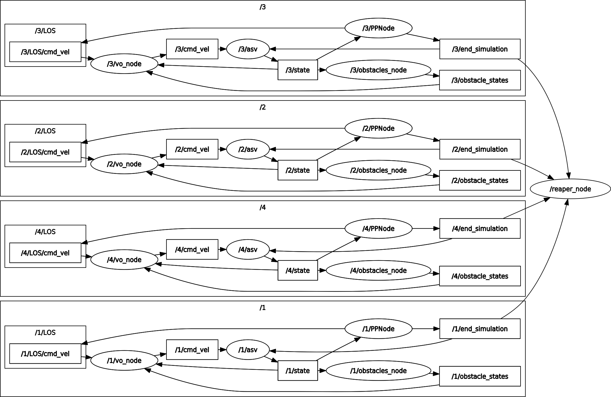
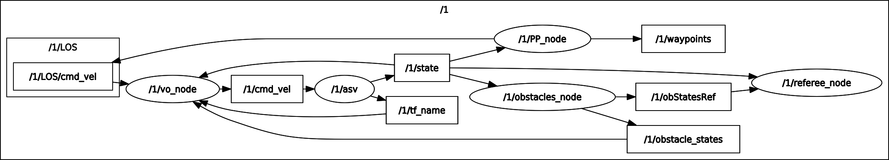
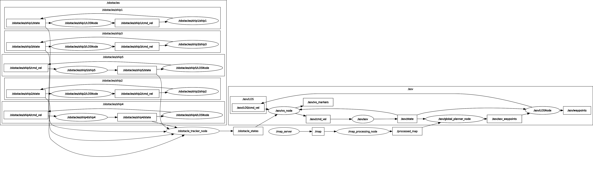

# The Planner Tester Package

## Installation

This package was coded on Ubuntu 20.04 LTS with ROS Noetic. It wouldn't work on previous versions of ROS because it uses Python 3.
Here are the steps to take to install it from scratch, starting from a plain Ubuntu 20.04 distribution.

### ROS Installation

The first step is to enable access to the repositories universe, multiverse and restricted if it not already. This needs to be typed in the terminal :

```
sudo add-apt-repository universe
sudo add-apt-repository multiverse
sudo add-apt-repository restricted
```

Then, we need to add the key to the ROS distribution :

```
sudo sh -c 'echo "deb http://packages.ros.org/ros/ubuntu $(lsb_release -sc) main" > /etc/apt/sources.list.d/ros-latest.list'
curl -s https://raw.githubusercontent.com/ros/rosdistro/master/ros.asc | sudo apt-key add -
```

Before launching the installation, check that all your packages are up to date :

```
sudo apt-get update && sudo apt-get upgrade
```

Finally, launch the installation (here we used the full version) :

```
sudo apt install ros-noetic-desktop-full
```

Before continuing, don't forget to source the ROS setup (**this needs to be done each time a new terminal is opened**) :

```
source /opt/ros/noetic/setup.bash
```

### Package Installation

Before installing the main package, we need to install the additional depedencies (some more may be necessary depending on your configuration) :

```
sudo apt install ros-noetic-tf2
sudo apt install libeigen3-dev
sudo apt install python3-pip
pip3 install pandas
pip3 install openpyxl
pip3 install scipy
pip3 install datetime
```

Finally, you need to be located in the directory where you want to install your ROS workspace, and proceed :

```
mkdir -p workspace/src/
cd workspace/src/
git clone https://github.com/Straccia11/seaowl.git
cd ..
catkin_make
```

(**Some problems may occur because of the package asv_msgs**)

You will need to source the package before starting to use it and **everytime you open a new terminal**. From the location of your workspace :

```
source devel/setup.bash
```

## Run

### Get Started

To launch a graphic user interface allowing to set easily the parameters, type in the terminal :

```
roscd asv_common
python3 executable5.py
```

### Launch Simulations

There are two ways of properly using the package : with launchfiles or with python APIs.

- Launchfiles are located in `asv_common/launch` and can be launched with

```
roslaunch asv_common name_of_the_launchfile.launch
```

- APIs are the python files located in `asv_common` and need to be executed by Python 3

```
roscd asv_common
python3 executable_file.py
```

The parameters can either be set manually in the launch files if the simulation is launched that way, either be entered in a graphic interface for `executable5.py`, or be set in an Excel or YAML file put in `asv_common/param/` and executed respectively with `executable6.py` or `executable9.py`.

### Inputs and Outputs

When a simulation is over, an input file and an output file (both plain text files) are respectively created in `asv_common/input/` and `asv_common/output/`. These are .txt files representing the table of all the parameters and indicators of all the opuses launched by a specific simulation. The naming convention is _YYYYMMDDhhmmss_.txt (Year, Month, Day, hour, minute, second of launch of the simulation). These informations can be plotted using `asv_common/graph_drawer.py`.

## Content

### Naming Conventions

- The source files are either located in a `/src` subdirectory of each package when written in C++, or in a `/nodes` subdirectory when written in Python. If the name of a file contains '_node_', then it is a file that creates a node.
- The scripts used to launch a test bench are in a `scripts/` directory in the concerned packages. The main scripts are in `scripts/python`. If their name contains '_man_', it is meant for launching a single simulation with user defined parameters, if it contains '_auto_' it is meant for launching a bench using the parameters from a file in the `/config/param/` directory of the package.
- In the structure of ROS, the nodes and topics are grouped in namespaces. For `open_seas_bench` and `cross_lane` packages, the namespaces are the number of the opus (this allows multiprocessing without naming conflicts). For `channeling`, the namespace is either `asv` or `obstacle/shipn` (n being the number of the ship), this allows to use several `asv_simulator_nodes`and path trackers.

### Packages

This package contains:

+ `asv_ctrl_vo`: an implementation of the "Velocity Obstacle" algorithm for
  collision avoidance
+ `asv_global_planner`: an implementation of the "A Star" algorithm for
  collision avoidance
+ `asv_map_processing`: a package meant for implementing the inflation of static obstacles
+ `asv_msgs`: message types used in the system
+ `asv_obstacle_tracker`: package that acts as a "black box", providing
  information about the states (and possibly metadata) that a collision avoidance
  system can subscribe to. _It does not actually track obstacles._ It is also
  possible to simulate the addition of sensor noise using this package. It also contains a node that directly simulate the obstacles if their trajectory is straight
+ `asv_path_trackers`: implements the (Integral) Line of Sight (LOS) method and
  a simple pure pursuit scheme for path following
+ `asv_referee`: package that contains all the node that contributes to the coordination and evaluation of the behavior of the ASV
+ `asv_simulator`: simulates a nonlinear 3DOF surface vessel
+ `state_estimator`: unfinished package for estimating the ASV pose given GPS
  and IMU data
+ `asv_common`: metapackage with launch files and more

### Nodes

| Package                   | Node(s)                           |
| ------------------------- | --------------------------------- |
| `asv_referee`           | `referee_node`, `reaper_node` |
| `asv_path_trackers`     | `LOS_node`, `PP_node`         |
| `asv_obstacle_trackers` | `obstacle_tracker_node`         |
| `asv_simulator`         | `simulator_node`                |
| `asv_global_planner`    | `global_planner_node`           |
| `asv_ctrl_vo`           | `ctrl_vo_node`                  |
| `asv_map_processing`    | `map_processing_node`           |

#### Main Nodes (required)

+ `simulator_node`: simulates the vessel
+ `LOS_node` / `PP_node`: implement a path tracker algorithm (either _Line Of Sight_ or _Pure Pursuit_) over an array of waypoints (the difference between the two algorithms can be found in  [Thomas Stenersen&#39;s thesis](https://ntnuopen.ntnu.no/ntnu-xmlui/bitstream/handle/11250/2352498/12747_FULLTEXT.pdf?sequence=1&isAllowed=y))
+ `obstacle_tracker_node / crossLaneObstNode / openSeasObstNode`: transmits the positions and velocities of the other ships to the ASV, and eventually simulates the obstacles.

- `obstacle_tracker_node` just track the positions and velocities of the obstacle, it is the default node that needs the obstacles to be simulated individually (with an `asv_simulator_node`) and is used in the `channeling` package
- `openSeasObstNode` simulates the obstacle for the `open_seas_bench` package and publish its data (one ship moving in a straight line)
- `crossLaneObstNode`simulates the obstacle for the `cross_lane` package and publish its data

#### Additional Important Nodes

+ `referee_node`: calculates all the performance indicators and etablish the times of beginning and end of the simulation. Can be set to _required_ in the launch file to automatically close the program at the end of the simulation (only for single processing)
+ `reaper_node`: in case of multiprocessing, kills all the nodes once they are all finished. Requires _`referee_node`_
+ `global_planner_node`: implements the global_planner, the one included is an _A Star_ planner but an other one can be integrated easily
+ `ctrl_vo_node`: implements the local planner in this case a _Velocity Obstacle_ planner. Another one can be integrated, but it would need to change the file architecture a bit
+ `map_processing_node`: if the simulation contains static obstacles (basically a map), creates a security margin with them by implementing obstacle inflation. Requires the _`map_server`_ node, which is included in the default ROS packages

#### Deprecated Nodes (for information)

+ `clock_node`: meant to accerate the simulation thus shortening its duration. Caused a degradation of the behavior of the algorithms and was then left out
+ `state_simulator_node`: incomplete implementation of the estimation of the ASV pose via GPS
+ `obstacle_tracker_nema_node`: can simulate and track the obstacles simulated by the emission of AIS signals via an UDP port. Was meant to be used with the software _Nema Studio_ but this possibility was left out
+ The whole file `asv_simulator/nodes` : these are utility nodes implemented in the original package that we never used

### Main Topics

_The **Architecture** part describes where each node publish and subscribe._

The topics are often included in diverse namespaces indicating the opus and/or vessel related to the specific topic.

- `/state` (type ): real pose and twist of a vessel
- `/LOS/cmd_vel / /PP/cmd_vel`, `/cmd_vel` (type ): twist of a vesset respectively calculated by the path tracker and the local planner
- `/obstacle_states` (type StateArray):
- `/end_simulation`, `/start_simulation` (type _Empty_): when a message is published, signal respectively the end or the beginning of the simulation (used to synchronize the nodes and automate the execution of the successive opuses)
- `/map`, `/processed_map`, `/localmap` (optionnal, type _Occupancy Grid_): if a static map is set in the parameters, `/map` is its conversion into an occupancy grid, `/processed_map` is the implementation of the inflated static obstacles and `/local_map` is a short-ranged non-static version of the map used by the local planner

### Utility Scripts

- `clear.sh`: removes the input and output or either a specific simulation or all the scripts
- `current_opus.sh`: indicates the maximum opus of the latest simulation
- `kill.sh`: kills all processes related to the package (to use when a simulation or several are running in the background)
- `concatenate.sh`: (**NOT YET WRITTEN**) concatenates two output and remove all the duplicate opuses
- `graph_drawer.py`: opens a graphical interface allowing to plot data from the results of a specific simulation
- `launch_background.sh`: launches `executable9.py` / `executable9Adrien.py` in the backgound and write the output and errors in the directory `log/` (**the parameters are in executable9**)
- `watch_cpu.py`: gives information about the CPUs and memory activity over a certain periiod of time (meant to determine how many processes can be launched simultaneously)
- `config.sh`: configures a new machine to be able to use the package (**not meant to be executed as a whole script but line by line**)
- `is_running.sh`: indicates if the process is still running (**not very trustworthy**)
- `rename.sh`: renames the input and output of a specific simulation (by default the latest)

### Launch Files and Executables

---

### Other Files

### Additional Message Types

All the message types specific to this package are generated and detailed in the sub-package `/asv_msgs`.

#### Maps

The use of a static map is optionnal. To integrate a map, you need to launch a `map_sever` node, isssued from the eponym ROS default package. This node convert a YAML file linked to a PNG image into a black and white Occupancy Grid(_see the notes at the end of the document for more details_). The occupancy grid is published on the global topic `/map`. Then the `map_processing_node` needs to be launched, and will subscribe to `/map` and process the occupancy grid to inflate the static obstacles, before publishing it to `/processed_map`. The `asv_global_planner_node` by default subscribes to `/processed_map` and the `asv_ctrl_vo_node` by default subscribes to `/map`. This can be changed by using the **remap** option in the launch file. This option can also be used to make the global planner and the local planner computes on two different maps (in channeling situations, the map of the global planner has the channel drawn on it, that of the local planner is the same but without the channel).

## Architecture

### File architecture

```
.
├── asv_common
│   ├── CMakeLists.txt
│   ├── config
│   │   ├── maps
│   │   │   └── ...
│   │   └── rviz
│   │       └── ...
│   ├── images
│   │   └── ...
│   ├── input
│   │   └── ...
│   ├── launch
│   │   ├── default.launch
│   │   └── mapserver.launch
│   ├── output
│   │   └── ...
│   ├── package.xml
│   └── scripts
│       └── watch_cpu.py
├── asv_ctrl_vo
│   ├── CMakeLists.txt
│   ├── include
│   │   └── asv_ctrl_vo
│   │       ├── asv_ctrl_vo.h
│   │       └── asv_ctrl_vo_node.h
│   ├── launch
│   │   └── vo.launch
│   ├── package.xml
│   └── src
│       ├── asv_ctrl_vo.cpp
│       └── asv_ctrl_vo_node.cpp
├── asv_global_planner
│   ├── CMakeLists.txt
│   ├── include
│   │   └── asv_global_planner
│   │       ├── asv_a_star.h
│   │       ├── asv_global_planner.h
│   │       └── asv_global_planner_node.h
│   ├── package.xml
│   └── src
│       ├── asv_a_star.cpp
│       ├── asv_global_planner.cpp
│       └── asv_global_planner_node.cpp
├── asv_map_processing
│   ├── CMakeLists.txt
│   ├── include
│   │   └── asv_map_processing
│   │       └── asv_map_processing_node.h
│   ├── package.xml
│   └── src
│       └── asv_map_processing_node.cpp
├── asv_msgs
│   ├── CMakeLists.txt
│   ├── msg
│   │   ├── Path.msg
│   │   ├── ShipMetaData.msg
│   │   ├── StateArray.msg
│   │   ├── State.msg
│   │   └── Waypoint2D.msg
│   └── package.xml
├── asv_obstacle_tracker
│   ├── CMakeLists.txt
│   ├── launch
│   │   ├── crossLaneObst.launch
│   │   ├── default.launch
│   │   ├── openSeasObst.launch
│   │   └── simple.launch
│   ├── nodes
│   │   ├── crossLaneObstNode.py
│   │   ├── obstacle_tracker_node.py
│   │   └── openSeasObstNode.py
│   └── package.xml
├── asv_path_trackers
│   ├── CMakeLists.txt
│   ├── launch
│   │   ├── LOSTracker.launch
│   │   └── PPTracker.launch
│   ├── nodes
│   │   ├── asv_ctrl_los_node_obstacles.py
│   │   ├── asv_ctrl_los_node.py
│   │   ├── asv_ctrl_pp_node.py
│   │   ├── __pycache__
│   │   │   └── utils.cpython-38.pyc
│   │   ├── utils.py
│   │   └── utils.pyc
│   └── package.xml
├── asv_referee
│   ├── CMakeLists.txt
│   ├── debug
│   │   ├── debug.py
│   │   ├── debug.txt
│   │   └── étalon.py
│   ├── launch
│   │   ├── reaper.launch
│   │   └── referee.launch
│   ├── nodes
│   │   ├── asv_clock_node.py
│   │   ├── asv_reaper_node.py
│   │   └── asv_referee_node.py
│   └── package.xml
├── asv_simulator
│   ├── CMakeLists.txt
│   ├── config
│   │   ├── models
│   │   │   └── ...
│   │   ├── parameters
│   │   │   ├── viknes2.yaml
│   │   │   └── viknes.yaml
│   │   ├── rosdoc.yaml
│   │   └── rviz
│   │       ├── config.rviz
│   │       ├── exec9.rviz
│   │       ├── map_and_proc_map.rviz
│   │       ├── one_vessel_with_map.rviz
│   │       ├── three_vessels.rviz
│   │       └── two_vessels.rviz
│   ├── include
│   │   ├── asv_simulator.h
│   │   ├── asv_simulator_node.h
│   │   └── wave_filter.h
│   ├── launch
│   │   ├── asvGp.launch
│   │   ├── default.launch
│   │   └── obstSimulator.launch
│   ├── LICENSE
│   ├── mainpage.dox
│   ├── meshes
│   │   └── ...
│   ├── package.xml
│   ├── README.md
│   └── src
│       ├── asv_simulator.cpp
│       ├── asv_simulator_node.cpp
│       └── wave_filter.cpp
├── channeling
│   ├── CMakeLists.txt
│   ├── config
│   │   ├── maps
│   │   │   ├── channel_toulon.png
│   │   │   ├── small_channel.png
│   │   │   └── small_channel.yaml
│   │   ├── param
│   │   │   └── wps.yaml
│   │   └── rviz
│   │       └── toulon.rviz
│   ├── launch
│   │   ├── channel.launch
│   │   └── toulon.launch
│   └── package.xml
├── cross_lane
│   ├── CMakeLists.txt
│   ├── config
│   │   ├── param
│   │   │   └── crossLane.yaml
│   │   └── rviz
│   │       └── crossLane.rviz
│   ├── input
│   │   └── ...
│   ├── launch
│   │   └── crossLane.launch
│   ├── output
│   │   └── ...
│   ├── package.xml
│   └── scripts
│       ├── auto_density.py
│       ├── auto_file.py
│       ├── graph_drawer.py
│       └── man_interface.py
├── open_seas_bench
│   ├── CMakeLists.txt
│   ├── config
│   │   ├── param
│   │   │   ├── bench1Ad.yaml
│   │   │   ├── bench1Jb.yaml
│   │   │   └── bench1.xlsx
│   │   └── rviz
│   │       └── openSeas.rviz
│   ├── input
│   │   └── ...
│   ├── launch
│   │   └── openSeasBench.launch
│   ├── log
│   │   ├── nohup.err
│   │   └── nohup.out
│   ├── output
│   │   └── ...
│   ├── package.xml
│   └── scripts
│       ├── data_viz
│       │   ├── graph_drawer_imp.py
│       │   └── graph_drawer_safety_groups.py
│       ├── python
│       │   ├── autoSim.py
│       │   ├── graph_drawer.py
│       │   ├── manGraphDrawer.py
│       │   └── manInterface.py
│       └── shell
│           ├── autoSimBg.sh
│           ├── autoSim.sh
│           ├── clear.sh
│           ├── config.sh
│           ├── current_opus.sh
│           ├── is_running.sh
│           ├── kill.sh
│           └── rename.sh
└── README.md

```

### Nodes and Topics

To be simulated, an ASV needs at the bare minimum an `asv_simulator_node` and a path tracker node (PP or LOS). If a global planner is added, it will be placed upstream of the path tracker, if a local planner is added it will be placed downstream of the path tracker.

Here is the node graph of a simulation launched by `open_seas_bench` (with 4 processes at the same time):


Here is the node graph of a simulation launched by `cross_lane` (without multiprocessing):


Here is the node graph of a simulation launched by `channeling` with 5 ships :


(For clarity of reading some secondary topics like `/start_simulation` have been hidden)

## Functional Description

### Test Benches

#### 1-to-1 Opens seas

Located in the package `open_seas_bench`.
This bench aims at evaluating the behavior of the ASV when encountering another ship in open seas, with a local planner and no global planner. In this case, the set of scenarios is meant to be as exhaustive as possible, in the purpose of detecting any weakness of the local planner that could happen in a precise maritime situation. The parameters (for now) are the following :

- **Heading** : every 20°
- **Theoretical dCPA** : -80m, -50m, -20m, -10m, 0m, 10m, 20m, 50m, 80m
- **Speed of the ASV** : 3kns, 5kts, 8kts, 10kts, 15kts, 20kts, 25kts, 30kts
- **Speed of the obstacle ship** : 3kts, 5kts, 8kts, 10kts, 15kts, 20kts, 25kts, 30kts with at least 5kts of difference for overtaking scenarios (heading of 0°, -20° or +20°)
- **Detection distance** : 50m, 100m, 200m, 500m

The total number of scenarios is a bit less than 41 472.

#### Cross Lane

Located in the package `cross_lane`.

This bench aims at evaluating the behavior of the ASV in a Traffic Separation Schemes (TSS). The original inspiration was the Dover Straits TSS, but the scheme's scale has been reduced for simulation time.

The situation has been simplified to crossing two parallel sea lanes with boats going from right to left (left lane) and left to right (called right lane) respectively. The obstacle boats have a uniform rectilinear motion along the direction of their respective lanes, but with different speeds. Their trajectories are distributed uniformly in the lateral direction (in order to prevent collisions between obstacles). In order to keep the density of boats constant without having to spawn a large number, the lanes are periodised, i.e. they are of finite length but when a boat arrives at one extremity it reappears at the other end (similar to Pac-Man).

The modifiable parameters for the obstacles are:

* the lanes respective widths (rlw, llw)
* the distance between the lanes (ld)
* the density of obstacles either by specifying
  * the number of boats per lane, having a finite length (rln, lln)
  * the density of boats (rld,lld)
* the size of the obstacles (size)
* the priority status of the obstacles (prior)
* the detection distance of the obstacles (d_detection)

For the mission of the ASV there is:

* the angle of the straight line joining the waypoints and the direction of the lanes (angle)
* the target speed of the ASV (u_d)

The length of the lanes is automatically fixed but can also be parametrised.

The speed distribution of the boats is fixed in `crossLaneObstNode.py`:

* 5 knots (20%)
* 10 knots (20%)
* 15 knots (20%)
* 20 knots (20%)
* 25 knots (20%)

For the moment, our main interest lies in the influence of the density on perforamance and security.

#### Channeling

This aims at evaluating the behavior of the ASV when leaving a harbor by a channel, with a local planner and a global planner. The ASV can encounter ships using the channel in the other way as well as ships crossing the channel. For the moment it only consists in a specific scenario, `toulon.launch`, where the ASV is going out of Toulon's harbor by its channel and encounters many ships in the channel. The functionnal parameters and indicators that can lead to the formulation of a test bench are still to be precised.

### Planners

#### Global Planner (A Star)

The implemented global planner is a basic A Star algorithm, with just a post processing algorithm to reduce the number of waypoints. If the waypoints are not calculated by the planner they must be set as parameters in the launch file. It is meant to be used on the processed map with inflated obstacles to guarantee a security margin. To add another global planner, one just needs to put the source file and the header in the package, update the `CMakeLists.txt` and change `asv_global_planner_node.cpp` at line **19** :

```
GlobalPlanner *gp = new GlobalPlanner;
```

by changing `GlobalPlanner` with a class inheriting from the former and corresponding to the planner implemented.

##### How to add one ?

To integrate a new global planner and use it, here are the steps to follow :

- First add a new .cpp file in `asv_global_planner/src` implementing the class with methods and attributes of the new GP (use the common functions described in `global_planner.cpp`). Also add in `as_global_planner/include` the corresponding .h header.
- Then go to `asv_global_planner_node.cpp`, line 27 and change it to :

```
NewPlanner *gp = new NewPlanner(**args);
```

where `NewPlanner` is the name of the class you created and `**args` are the arguments of yout constructor, if required.

- Finally, go back to the root of the workspace and launch `catkin_make`

NB: this method doesn't allow to change easily between different global planners because it needs to modify the source code at each change of GP. A better way would be to use the parameter `global_planner` in the launch files and use it to parametrize the name of the class of the planner that needs to be used.

#### Local Planner (Velocity Obstacle)

The local planner already implemented is a Velocity Obstacle (VO) taking account of the COLREGS. The algorithm is detailled in Stenersen's thesis. It considers the static obstacles but hardly, and without any security margin. It can be more convenient to feed two different maps to the local and the global planner (when in a channel for example). When it comes to the obstacle ships, the VO considers a security distance defined in `asv_ctrl_vo/asv_ctrl_vo_node.cpp` line **149** :

```
double combined_radius = RADIUS_ + it->header.radius;
```

By default, `RADIUS_` is 10m but the size af the ASV is 8m, so it allows a secrity distance of only 2m, which is very close and quite dangerous. That is why we worked a lot with a modified version of the planner where we just commented this line and uncommented the previous one (**do not forget to call `catkin_make` in the main directory of the workspace to compile the changes on a .cpp or .h file**) :

```
double combined_radius = RADIUS_*std::max((v_ret+0.5),1.0) + it->header.radius;
```

This distance increases with the relative speed between the two ships, thus resulting in safer and more reasonable security margins. However, it was meant for open seas and this version of the planner might encounter hardships in restricted spaces. It is possible to integrate another local planner, but it would need to modify more in depth the package.

##### How to add one ?

The steps to follow are basically the same but with the file `asv_ctrl_vo/src/asv_ctrl_vo_node.cpp` line 24. The structures of the files are however not as adapted as for th GP node, there might be some other changes to do to the file. Most local planners need a path trackers to work, but some just need an array of waypoints, for the latter, a subscriber to `asv/waypoints` needs to be added and the path tracker node doesn't need to be run.
The same remark as for the GP also applies.

### APIs and .launch files

The .launch files are launched by the _roslaunch_ package, which has very limited features. In particular, it is meant to launch a single simulation, and allows very little automation. That is why we worked mostly with pythons APIs, which are python scripts that can call roslaunch to execute .launch files, with different parameters and allowing the automation of a whole list of scenarios. These parameters can either be entered by hand (`executable5.py`), be entered in an Excel file in `asv_common/config/param` (`executable6.py`), or for larger sets, be entered as lists in a YAML file (same path) and then be executed by `executable9.py`.

#### Multiprocessing

For now only `executable9.py` uses multiprocessing to launch several simulations simultaneously. It has several parameters set as global variables : `NB_PROCESS`, `OPUS_START` and `SERIAL_TO_UPDATE`. The first one is the number of simulations that will be simultaneously launched. It depends on the capacities of the processor of the computer executing the program, and on the computing power needed by the simulations (especially the local planner). The script `watch_cpu.sh` can help to determine the best number of processes by testing with several values (launch the script before the simulation and end it afterwards). `OPUS_START` and `SERIAL_TO_UPDATE` need to be changed if the executable needs to start but from a specific opus and needs to append the output to a previous file.

## Results

---

## Issues and Improvements to be Made

- The gestion of maps has been since now quite laborious, consisting in screenshots from google maps arranged on Paint so that the constrast between the sea and the land would be strong enough to be detected by the `map_server` node, and the channels have been drawn by hand. There is surely a more convenient way to do the image processing.
- The integration of global and local planners can be made easier if the manipulation of multiples planners is needed

## Notes and Remarks

- The integration model of the simulator node described in the thesis has been upgraded to use Runge Kuta 4 instead of the method of Euler.
- Each time an opus is launched, some information is written in ROS log files. Little by little, this can lead to huge amount of useless data using space on the machine, that's why it might be interesting when launching long benches to purge the log files that way :

```
rosclean purge
```

- The original package allowed to simulate waves and bad weather, we didn't use that but it can be made by changing mentions of the file `asv_simulator/config/parmeters/viknes2.yaml` with `asv_simulator/config/parmeters/viknes.yaml`
