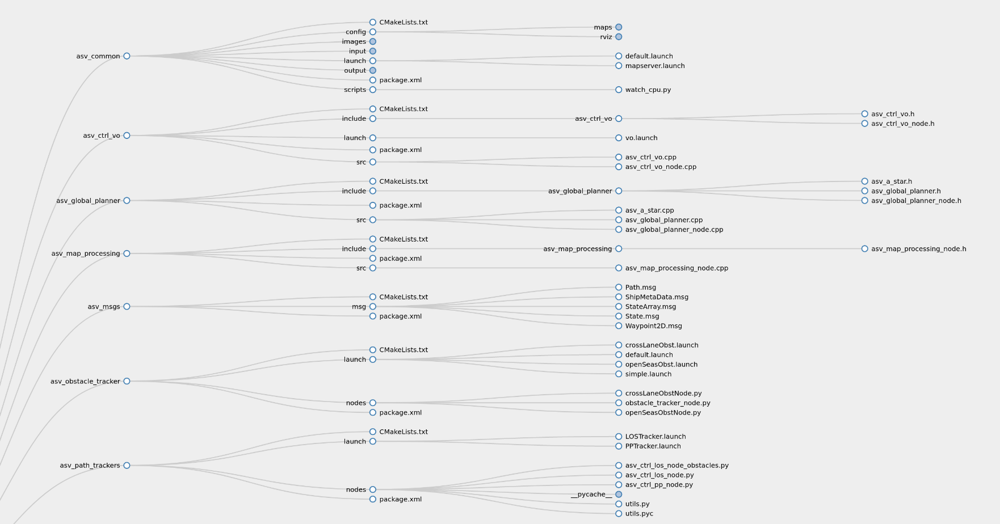
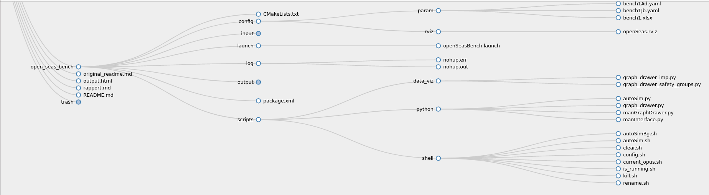

***
- Contexte du stage
- Problème ?
-  Etat de l'art du sujet
- Description détaillée de la problématique fonctionnelle
- Approche solution
- Implémentation:
	- Choix technologique
	- Plateforme technique
	- Installation / configuration / run
- Restitution des résultats / Phase Analytics
- Quels sont les objectifs atteints ? ceux qui ne sont pas atteints
- Annexe: scriptes / programmes avec commentaires

détailler le projet inspear ?

***

***
The topic of autonomous vehicles, in paricular autonomous surface vessels (ASV), is a major point of interest in nowaday's world of innovation; one just need to see how the Google car or Tesla gained attention and admiration from the general public to notice that. One of the main challenges to overcome in these projects is the path planning, or how will the vehicle compute his course and at the same time avoid the obstacles on his way. The project Inspear concerns one of those ASVs, and it is subject to the same problematics. However, in order to write a path planning algorithm that is efficient enough to meet expectations, it is necessary to be able to evaluate it. This is the issue that this report handles : how to evaluate the performance of a path planning algorithm ?

Most path planning algorithms for ASVs are composed of two parts : a global planner and a local planner. The global planner sets the trajectory to follow based on a static map of the evironment and the mission that it has to do (escort of patrolling for example); the local planner is a collision avoidance algorithm meant to modify the trajectory if an unexpected obstacle comes close. Most of the time this obstacle would be a ship, and in that case, the planner must ensure that the ASV complies with the regulations on the rules of navigation (COLREGs). These two planners don't have the same importance whether the ASV is in open seas, in a coastal area or sailing out of a harbor.

Indeed, an ASV is meant to bea able to encounter a lot of diverse situations at sea in more or less risky environments depending on a whole variety of parameters : speed, proximity of the land, visibility... To evaluate a path planning algorithm, it is thus essential to analyse its behavior in a set of situations that are representative of what an ASV might possibly encounter.

Moreover, analysing the behavior of a path planner in a specific situation is not a trivial tasks : it relies on human decision  and sailor expertise. But these are subjective, unprecise and unadapted to a path planner evaluation platform. These analysises need to be put in number by the means of different KPIs (performance indicators). And to compute these KPIs, it is essential to be able to simulate the behavior of an ASV using a specific algorithm of path planner.

Thus, we

However, in order to select a path planning algorithm that is efficient enough to meet expectations, it is necessary to be able to evaluate its behavior in more or less risky situations. This implies on the one hand to define these situations in which the algorithm will be tested so that they are faithful to the real situations the drone could be confronted with, on the other hand to objectively define safety and performance criteria in order to be able to compare the path planning algorithms between them, and finally to implement the test platform that will allow to simulate the behavior of an algorithm according to these situations and to automate the process.

The company is in search of an efficient path planning algorithm for the Inspector UAV project. In view of the multitude of existing algorithms, the context of the approach chosen by each of them and the criteria used to characterize their performance, it is necessary to be able to simulate the behavior of each of these algorithms on a large number of more or less specific but real situations and to evaluate them according to performance and safety criteria in order to be able to search for an algorithm that best satisfies these criteria.


***

L'objet de ce rapport est le projet de path planning commencé en avril 2021. Ce travail s'inscrit dans le cadre du projet inspear, plus précisément dans l'élaboration des algorithmes de path planning du drone. L'objectif de ces algorithmes est de permettre au drone de pouvoir se mouvoir accordement à la mission qui lui est confiée (généralement de l'escorte ou de la surveillance de zone) tout en évitant toute collision sur le chemin, et en respectant la réglementation sur les règles de navigation (COLREGs) en vigueur vis-à-vis des autres bateaux.

Seulement, pour pouvoir sélectionner un algorithme de path planning suffisamment performant pour répondre aux attentes, il faut être capable d'évaluer son comportement dans des situations plus ou moins à risque. Cela implique d'une part de définir ces situations dans lesquels l'algorithme va être testé afin qu'elles soient fidèles aux situations réelles auxquelles le drone pourrait être confronté, d'autre part de définir objectivement des critères de sécurités et de performance chiffrés afin de pouvoir comparer les algorithmes de path planning entre eux, et enfin d'implémenter la plate-forme de test qui permettra de simuler le comportement d'un algorithme selon ces situations et d'automatiser le processus.


L'entreprise est en recherche d'un algorithme de path planning performant pour le projet du drone inspear, ce faisant au vu de la multitude des algorithmes déjà existant, du contexte de l'approche choisie par chacun d'entre eux et des critères utilisés pour caractériser leurs performances, il faut être capable de pouvoir simuler sur un grand nombre de situations plus ou moins spécifiques mais réelles le comportement de chacun de ces algorithmes et les évaluer selon des critères de performance et de sécurité afin de pouvoir rechercher un algorithme satisfaisant aux mieux ces critères.

## Presentation of the Subject
The subject of this report is the path planning project started in April 2021. This work is part of the inspear project, more precisely in the development of path planning algorithms for the UAV. The objective of these algorithms is to allow the drone to be able to move according to the mission that is entrusted to it (generally escort or surveillance of area) while avoiding any collision on the path, and respecting the regulations on the rules of navigation (COLREGs) in force with respect to other vessels.

However, in order to select a path planning algorithm that is sufficiently efficient to meet expectations, it is necessary to be able to evaluate its behavior in more or less risky situations. This implies on the one hand to define these situations in which the algorithm will be tested so that they are faithful to the real situations the drone could be confronted with, on the other hand to objectively define safety and performance criteria in order to be able to compare the path planning algorithms between them, and finally to implement the test platform that will allow to simulate the behavior of an algorithm according to these situations and to automate the process.


The company is in search of an efficient path planning algorithm for the Inspector UAV project. In view of the multitude of existing algorithms, the context of the approach chosen by each of them and the criteria used to characterize their performance, it is necessary to be able to simulate the behavior of each of these algorithms on a large number of more or less specific but real situations and to evaluate them according to performance and safety criteria in order to be able to search for an algorithm that best satisfies these criteria.


## Implementation
### Installation
This package was coded on Ubuntu 20.04 LTS with ROS Noetic. It wouldn't work on previous versions of ROS because it uses Python 3.
Here are the steps to take to install it from scratch, starting from a plain Ubuntu 20.04 distribution.

#### ROS Installation
The first step is to enable access to the repositories universe, multiverse and restricted if it not already. This needs to be typed in the terminal :
```
sudo add-apt-repository universe
sudo add-apt-repository multiverse
sudo add-apt-repository restricted
```
Then, we need to add the key to the ROS distribution :
```
sudo sh -c 'echo "deb http://packages.ros.org/ros/ubuntu $(lsb_release -sc) main" > /etc/apt/sources.list.d/ros-latest.list'
curl -s https://raw.githubusercontent.com/ros/rosdistro/master/ros.asc | sudo apt-key add -
```
Before launching the installation, check that all your packages are up to date :
```
sudo apt-get update && sudo apt-get upgrade
```
Finally, launch the installation (here we used the full version) :
```
sudo apt install ros-noetic-desktop-full
```
Before continuing, don't forget to source the ROS setup (**this needs to be done each time a new terminal is opened**) :
```
source /opt/ros/noetic/setup.bash
```
#### Package Installation
Before installing the main package, we need to install the additional depedencies (some more may be necessary depending on your configuration) :
```
sudo apt install ros-noetic-tf2
sudo apt install libeigen3-dev
sudo apt install python3-pip
pip3 install pandas
pip3 install openpyxl
pip3 install scipy
pip3 install datetime
```
Finally, you need to be located in the directory where you want to install your ROS workspace, and proceed :
```
mkdir -p workspace/src/
cd workspace/src/
git clone https://github.com/Straccia11/seaowl.git
cd ..
catkin_make
```
(**Some problems may occur because of the package asv_msgs**)

You will need to source the package before starting to use it and **everytime you open a new terminal**. From the location of your workspace :
```
source devel/setup.bash
```
### Run

#### Get Started
##### Open Seas
To launch a graphic user interface allowing to set easily the parameters of an _open seas_ situation, type in the terminal :
```
roscd open_seas_bench/scripts/python
python3 manInterface.py
```
##### Cross Lane
To launch a graphic user interface allowing to set easily the parameters of a _cross lane_ situation, type in the terminal :
```
roscd cross_lane/scripts
python3 man_interface.py
```
##### Channeling
To launch a simulation of a _channeling_ situation, type in the terminal :
```
roslaunch channeling toulon.launch
```

#### Launch Simulations
There are two ways of properly using the package : with launchfiles or with python APIs.

- Launchfiles are located in the `launch/` directories of each package and can be launched with
```
roslaunch name_of_the_package name_of_the_launchfile.launch
```
For some, launching them separately is pointless because they need to be called by other .launch files. The files that can be launched independently are located in `open_seas_bench`, `cross_lane` or `channeling` packages.
- Python executables are the python files located in the `scripts/python/` directories of each package and need to be executed by Python 3
```
roscd name_of_the_package/scripts
python3 name_of_the_executable.py
```

The parameters can either be set manually in the launch files if the simulation is launched that way, either be entered in a graphic interface for files named `man_interface.py`, or be set in an Excel or YAML file put in the `config/param/` directory of the package and executed with one of the scripts whose name begin with '_auto_'.

#### Inputs and Outputs
When a simulation is over, an input file and an output file (both plain text files) are respectively created in `asv_common/input/` and `asv_common/output/`. These are .txt files representing the table of all the parameters and indicators of all the opuses launched by a specific simulation. The naming convention is _YYYYMMDDhhmmss_.txt (Year, Month, Day, hour, minute, second of launch of the simulation). These informations can be plotted using `asv_common/graph_drawer.py`.

##### Output indicators

The output consists of diverse performance indicators relative to each opus :
- The duration of the opus  
- Three indicators of security : natural, logarithmic and logarithmic with offset
- Four indicators of anticipation : acc, omega, r and time  
- Four indicators of agglutination : acc, omega, r and time
- The real dCPA of the ASV with the ships (not with static obstacles)
- The minimum distance at which the ASV crossed in front of a ship (-1 if the ASV didn't cross by the front side of the obstacle)
- The number of times the ship crossed in front of the ASV (if the ship moves in a straight line, it reveals how much the ASV hesitated before choosing to cross by port or starboard)

**Include the pdf file written by Adrien**

### Content
#### Naming Conventions
- The source files are either located in a `/src` subdirectory of each package when written in C++, or in a `/nodes` subdirectory when written in Python. If the name of a file contains '_node_', then it is a file that creates a node.
- The scripts used to launch a test bench are in a `scripts/` directory in the concerned packages. The main scripts are in `scripts/python`. If their name contains '_man_', it is meant for launching a single simulation with user defined parameters, if it contains '_auto_' it is meant for launching a bench using the parameters from a file in the `/config/param/` directory of the package.
- In the structure of ROS, the nodes and topics are grouped in namespaces. For `open_seas_bench` and `cross_lane` packages, the namespaces are the number of the opus (this allows multiprocessing without naming conflicts). For `channeling`, the namespace is either `asv` or `obstacle/shipn` (n being the number of the ship), this allows to use several `asv_simulator_nodes`and path trackers.

#### Packages
This package contains:
+ `asv_ctrl_vo`: an implementation of the "Velocity Obstacle" algorithm for
collision avoidance
+ `asv_global_planner`: an implementation of the "A Star" algorithm for
collision avoidance
+ `asv_map_processing`: a package meant for implementing the inflation of static obstacles
+ `asv_msgs`: message types used in the system
+ `asv_obstacle_tracker`: package that acts as a "black box", providing
information about the states (and possibly metadata) that a collision avoidance
system can subscribe to. _It does not actually track obstacles._ It is also
possible to simulate the addition of sensor noise using this package. It also contains a node that directly simulate the obstacles if their trajectory is straight
+ `asv_path_trackers`: implements the (Integral) Line of Sight (LOS) method and
a simple pure pursuit scheme for path following
+ `asv_referee`: package that contains all the node that contributes to the coordination and evaluation of the behavior of the ASV
+ `asv_simulator`: simulates a nonlinear 3DOF surface vessel
+ `state_estimator`: unfinished package for estimating the ASV pose given GPS
and IMU data
+ `asv_common`: metapackage with launch files and more

#### Nodes

| Package | Node(s) |
| --- | --- |
| `asv_referee` | `referee_node`, `reaper_node` |
| `asv_path_trackers` | `LOS_node`, `PP_node` |
| `asv_obstacle_trackers` | `obstacle_tracker_node`  |
| `asv_simulator` | `simulator_node` |
| `asv_global_planner` | `global_planner_node` |
| `asv_ctrl_vo` | `ctrl_vo_node` |
| `asv_map_processing` | `map_processing_node` |

##### Main Nodes (required)
+ `simulator_node`: simulates the vessel
+ `LOS_node` / `PP_node`: implement a path tracker algorithm (either _Line Of Sight_ or _Pure Pursuit_) over an array of waypoints (the difference between the two algorithms can be found in  [Thomas Stenersen's thesis](https://ntnuopen.ntnu.no/ntnu-xmlui/bitstream/handle/11250/2352498/12747_FULLTEXT.pdf?sequence=1&isAllowed=y))
+ `obstacle_tracker_node / crossLaneObstNode / openSeasObstNode`: transmits the positions and velocities of the other ships to the ASV, and eventually simulates the obstacles.
 - `obstacle_tracker_node` just track the positions and velocities of the obstacle, it is the default node that needs the obstacles to be simulated individually (with an `asv_simulator_node`) and is used in the `channeling` package
 - `openSeasObstNode` simulates the obstacle for the `open_seas_bench` package and publish its data (one ship moving in a straight line)
 - `crossLaneObstNode`simulates the obstacle for the `cross_lane` package and publish its data

##### Additional Important Nodes
+ `referee_node`: calculates all the performance indicators and etablish the times of beginning and end of the simulation. Can be set to _required_ in the launch file to automatically close the program at the end of the simulation (only for single processing)
+ `reaper_node`: in case of multiprocessing, kills all the nodes once they are all finished. Requires _`referee_node`_
+ `global_planner_node`: implements the global_planner, the one included is an _A Star_ planner but an other one can be integrated easily
+ `ctrl_vo_node`: implements the local planner in this case a _Velocity Obstacle_ planner. Another one can be integrated, but it would need to change the file architecture a bit
+ `map_processing_node`: if the simulation contains static obstacles (basically a map), creates a security margin with them by implementing obstacle inflation. Requires the _`map_server`_ node, which is included in the default ROS packages


##### Deprecated Nodes (for information)
+ `clock_node`: meant to accerate the simulation thus shortening its duration. Caused a degradation of the behavior of the algorithms and was then left out
+ `state_simulator_node`: incomplete implementation of the estimation of the ASV pose via GPS
+ `obstacle_tracker_nema_node`: can simulate and track the obstacles simulated by the emission of AIS signals via an UDP port. Was meant to be used with the software _Nema Studio_ but this possibility was left out
+ The whole file `asv_simulator/nodes` : these are utility nodes implemented in the original package that we never used

#### Main Topics
_The **Architecture** part describes where each node publish and subscribe._

The topics are often included in diverse namespaces indicating the opus and/or vessel related to the specific topic.

- `/state` (type ): real pose and twist of a vessel
- `/LOS/cmd_vel / /PP/cmd_vel`, `/cmd_vel` (type ): twist of a vesset respectively calculated by the path tracker and the local planner  
- `/obstacle_states` (type StateArray):
- `/end_simulation`, `/start_simulation` (type _Empty_): when a message is published, signal respectively the end or the beginning of the simulation (used to synchronize the nodes and automate the execution of the successive opuses)
- `/map`, `/processed_map`, `/localmap` (optionnal, type _Occupancy Grid_): if a static map is set in the parameters, `/map` is its conversion into an occupancy grid, `/processed_map` is the implementation of the inflated static obstacles and `/local_map` is a short-ranged non-static version of the map used by the local planner  


#### Scripts
The packages `open_seas_bench` and `cross_lane` contain several script written in python or shell.

##### Executable Scripts

- `manInterface.py` : launches a GUI allowing the user to manually set the parameters of the simulation and then launch the simulation
- `autoSim.py` : launches an automated series of simulations from a parmaeter file. Only allows single processing
- `autoSim.sh` : executes the precedent file, but allowing it to use multi processing
- `graph_drawer.py` : data visualization from the input and output files of a simulation. The variant `graph_drawer_safety_groups.py` classifies the opuses into different groups in function of their indicators of security, time and anticipation

##### Utility Scripts

- `clear.sh`: removes the input and output or either a specific simulation or all the scripts
- `current_opus.sh`: indicates the maximum opus of the latest simulation  
- `kill.sh`: kills all processes related to the package (to use when a simulation or several are running in the background)               
- `concatenate.sh`: (**NOT YET WRITTEN**) concatenates two output and remove all the duplicate opuses  
- `graph_drawer.py`: opens a graphical interface allowing to plot data from the results of a specific simulation
- `watch_cpu.py`: gives information about the CPUs and memory activity over a certain periiod of time (meant to determine how many processes can be launched simultaneously)
- `config.sh`: configures a new machine to be able to use the package (**not meant to be executed as a whole script but line by line**)      
- `is_running.sh`: indicates if the process is still running (**not very trustworthy**)    
- `rename.sh`: renames the input and output of a specific simulation (by default the latest)


#### Other Directories

There are a few other directories that serve different purposes :
- `rviz` : each of these directories contains the configuration files for launching rviz (.rviz)
- `maps` : each of these directories contains the .png image and the related YAML file for set a specific map as a parameter
- `asv_common/images` : contains a few images to decorate the interfaces
- `asv_simulator/parameters` : contains the cinematic parameters of the ASV (model Viknes), not to be confused with the `config/param` directories on other packages that contains the benches of parameters
- `asv_simulator/meshes` : contains the meshes of the ASV for visual representation on rviz
- `log` : these directories keep track of the output and errors of a simulation launched in the background, it is useful for debugging or spotting an anomaly


#### Additional Message Types

All the message types specific to this package are generated and detailed in the sub-package`/asv_msgs`.

#### Maps
The use of a static map is optionnal. To integrate a map, you need to launch a `map_sever` node, isssued from the eponym ROS default package. This node convert a YAML file linked to a PNG image into a black and white Occupancy Grid(_see the notes at the end of the document for more details_). The occupancy grid is published on the global topic `/map`. Then the `map_processing_node` needs to be launched, and will subscribe to `/map` and process the occupancy grid to inflate the static obstacles, before publishing it to `/processed_map`. The `asv_global_planner_node` by default subscribes to `/processed_map` and the `asv_ctrl_vo_node` by default subscribes to `/map`. This can be changed by using the **remap** option in the launch file. This option can also be used to make the global planner and the local planner computes on two different maps (in channeling situations, the map of the global planner has the channel drawn on it, that of the local planner is the same but without the channel).

#### Architecture
###### File architecture
```
.
├── asv_common
│   ├── CMakeLists.txt
│   ├── config
│   │   ├── maps
│   │   │   └── ...
│   │   └── rviz
│   │       └── ...
│   ├── images
│   │   └── ...
│   ├── input
│   │   └── ...
│   ├── launch
│   │   ├── default.launch
│   │   └── mapserver.launch
│   ├── output
│   │   └── ...
│   ├── package.xml
│   └── scripts
│       └── watch_cpu.py
├── asv_ctrl_vo
│   ├── CMakeLists.txt
│   ├── include
│   │   └── asv_ctrl_vo
│   │       ├── asv_ctrl_vo.h
│   │       └── asv_ctrl_vo_node.h
│   ├── launch
│   │   └── vo.launch
│   ├── package.xml
│   └── src
│       ├── asv_ctrl_vo.cpp
│       └── asv_ctrl_vo_node.cpp
├── asv_global_planner
│   ├── CMakeLists.txt
│   ├── include
│   │   └── asv_global_planner
│   │       ├── asv_a_star.h
│   │       ├── asv_global_planner.h
│   │       └── asv_global_planner_node.h
│   ├── package.xml
│   └── src
│       ├── asv_a_star.cpp
│       ├── asv_global_planner.cpp
│       └── asv_global_planner_node.cpp
├── asv_map_processing
│   ├── CMakeLists.txt
│   ├── include
│   │   └── asv_map_processing
│   │       └── asv_map_processing_node.h
│   ├── package.xml
│   └── src
│       └── asv_map_processing_node.cpp
├── asv_msgs
│   ├── CMakeLists.txt
│   ├── msg
│   │   ├── Path.msg
│   │   ├── ShipMetaData.msg
│   │   ├── StateArray.msg
│   │   ├── State.msg
│   │   └── Waypoint2D.msg
│   └── package.xml
├── asv_obstacle_tracker
│   ├── CMakeLists.txt
│   ├── launch
│   │   ├── crossLaneObst.launch
│   │   ├── default.launch
│   │   ├── openSeasObst.launch
│   │   └── simple.launch
│   ├── nodes
│   │   ├── crossLaneObstNode.py
│   │   ├── obstacle_tracker_node.py
│   │   └── openSeasObstNode.py
│   └── package.xml
├── asv_path_trackers
│   ├── CMakeLists.txt
│   ├── launch
│   │   ├── LOSTracker.launch
│   │   └── PPTracker.launch
│   ├── nodes
│   │   ├── asv_ctrl_los_node_obstacles.py
│   │   ├── asv_ctrl_los_node.py
│   │   ├── asv_ctrl_pp_node.py
│   │   ├── utils.py
│   │   └── utils.pyc
│   └── package.xml
├── asv_referee
│   ├── CMakeLists.txt
│   ├── debug
│   │   ├── debug.py
│   │   ├── debug.txt
│   │   └── étalon.py
│   ├── launch
│   │   ├── reaper.launch
│   │   └── referee.launch
│   ├── nodes
│   │   ├── asv_clock_node.py
│   │   ├── asv_reaper_node.py
│   │   └── asv_referee_node.py
│   └── package.xml
├── asv_simulator
│   ├── CMakeLists.txt
│   ├── config
│   │   ├── models
│   │   │   └── ...
│   │   ├── parameters
│   │   │   ├── viknes2.yaml
│   │   │   └── viknes.yaml
│   │   ├── rosdoc.yaml
│   │   └── rviz
│   │       └── ...
│   ├── include
│   │   ├── asv_simulator.h
│   │   ├── asv_simulator_node.h
│   │   └── wave_filter.h
│   ├── launch
│   │   ├── asvGp.launch
│   │   ├── default.launch
│   │   └── obstSimulator.launch
│   ├── LICENSE
│   ├── mainpage.dox
│   ├── meshes
│   │   └── ...
│   ├── package.xml
│   ├── README.md
│   └── src
│       ├── asv_simulator.cpp
│       ├── asv_simulator_node.cpp
│       └── wave_filter.cpp
├── channeling
│   ├── CMakeLists.txt
│   ├── config
│   │   ├── maps
│   │   │   ├── channel_toulon.png
│   │   │   ├── small_channel.png
│   │   │   └── small_channel.yaml
│   │   ├── param
│   │   │   └── wps.yaml
│   │   └── rviz
│   │       └── toulon.rviz
│   ├── launch
│   │   ├── channel.launch
│   │   └── toulon.launch
│   └── package.xml
├── cross_lane
│   ├── CMakeLists.txt
│   ├── config
│   │   ├── param
│   │   │   └── crossLane.yaml
│   │   └── rviz
│   │       └── crossLane.rviz
│   ├── input
│   │   └── ...
│   ├── launch
│   │   └── crossLane.launch
│   ├── output
│   │   └── ...
│   ├── package.xml
│   └── scripts
│       ├── auto_density.py
│       ├── auto_file.py
│       ├── graph_drawer.py
│       └── man_interface.py
├── open_seas_bench
│   ├── CMakeLists.txt
│   ├── config
│   │   ├── param
│   │   │   ├── bench1Ad.yaml
│   │   │   ├── bench1Jb.yaml
│   │   │   └── bench1.xlsx
│   │   └── rviz
│   │       └── openSeas.rviz
│   ├── input
│   │   └── ...
│   ├── launch
│   │   └── openSeasBench.launch
│   ├── log
│   │   ├── nohup.err
│   │   └── nohup.out
│   ├── output
│   │   └── ...
│   ├── package.xml
│   └── scripts
│       ├── data_viz
│       │   ├── graph_drawer_imp.py
│       │   └── graph_drawer_safety_groups.py
│       ├── python
│       │   ├── autoSim.py
│       │   ├── graph_drawer.py
│       │   ├── manGraphDrawer.py
│       │   └── manInterface.py
│       └── shell
│           ├── autoSimBg.sh
│           ├── autoSim.sh
│           ├── clear.sh
│           ├── config.sh
│           ├── current_opus.sh
│           ├── is_running.sh
│           ├── kill.sh
│           └── rename.sh
└── README.md

```






#### Nodes and Topics

To be simulated, an ASV needs at the bare minimum an `asv_simulator_node` and a path tracker node (PP or LOS). If a global planner is added, it will be placed upstream of the path tracker, if a local planner is added it will be placed downstream of the path tracker.

Here is the node graph of a simulation launched by `open_seas_bench` (with 4 processes at the same time):


Here is the node graph of a simulation launched by `cross_lane` (without multiprocessing):


Here is the node graph of a simulation launched by `channeling` with 5 ships :


(For clarity of reading some secondary topics like `/start_simulation` have been hidden)

### Functional Description
#### Test Benches
##### 1-to-1 Opens seas
Located in the package `open_seas_bench`.
This bench aims at evaluating the behavior of the ASV when encountering another ship in open seas, with a local planner and no global planner. In this case, the set of scenarios is meant to be as exhaustive as possible, in the purpose of detecting any weakness of the local planner that could happen in a precise maritime situation. The parameters of the tested bench are the following :

- **Heading** : every 20°
- **Theoretical dCPA** : -80m, -50m, -20m, -10m, 0m, 10m, 20m, 50m, 80m
- **Speed of the ASV** : 3kns, 5kts, 8kts, 10kts, 15kts, 20kts, 25kts, 30kts
- **Speed of the obstacle ship** : 3kts, 5kts, 8kts, 10kts, 15kts, 20kts, 25kts, 30kts with at least 5kts of difference for overtaking scenarios (heading of 0°, -20° or +20°)
- **Detection distance** : 50m, 100m, 200m, 500m

The total number of scenarios is a bit less than 41 472.

It is also possible by launching a manual interface to change :
 - the size of the obstacle ship
 - the priority status of the obstacle ship (none, stand on or give way, this only concerns the status independantly of the current situation)

##### Cross Lane
Located in the package `cross_lane`.

This bench aims at evaluating the behavior of the ASV in a Traffic Separation Schemes (TSS). The original inspiration was the Dover Straits TSS, but the scheme's scale has been reduced for simulation time.

The situation has been simplified to crossing two parallel sea lanes with boats going from right to left (left lane) and left to right (called right lane) respectively. The obstacle boats have a uniform rectilinear motion along the direction of their respective lanes, but with different speeds. Their trajectories are distributed uniformly in the lateral direction (in order to prevent collisions between obstacles). In order to keep the density of boats constant without having to spawn a large number, the lanes are periodised, i.e. they are of finite length but when a boat arrives at one extremity it reappears at the other end (similar to Pac-Man).

The modifiable parameters for the obstacles are:

* the lanes respective widths (rlw, llw)
* the distance between the lanes (ld)
* the density of obstacles either by specifying
  * the number of boats per lane, having a finite length (rln, lln)
  * the density of boats (rld,lld)
* the size of the obstacles (size)
* the priority status of the obstacles (prior)
* the detection distance of the obstacles (d_detection)

For the mission of the ASV there is:

* the angle of the straight line joining the waypoints and the direction of the lanes (angle)
* the target speed of the ASV (u_d)

The length of the lanes is automatically fixed but can also be parametrised.

The speed distribution of the boats is fixed in `crossLaneObstNode.py`:

* 5 knots (20%)
* 10 knots (20%)
* 15 knots (20%)
* 20 knots (20%)
* 25 knots (20%)

For the moment, our main interest lies in the influence of the density on perforamance and security.

##### Channeling
This aims at evaluating the behavior of the ASV when leaving a harbor by a channel, with a local planner and a global planner. The ASV can encounter ships using the channel in the other way as well as ships crossing the channel. For the moment it only consists in a specific scenario, `toulon.launch`, where the ASV is going out of Toulon's harbor by its channel and encounters many ships in the channel. The functionnal parameters and indicators that can lead to the formulation of a test bench are still to be precised.


#### Planners
##### Global Planner (A Star)
The global planner (GP) is located in the `asv_global_planner` package.
The implemented global planner is a basic A Star algorithm, with just a post processing algorithm to reduce the number of waypoints. If the waypoints are not calculated by the planner they must be set as parameters in the launch file. It is meant to be used on the processed map with inflated obstacles to guarantee a security margin.

###### How to add one ?
To integrate a new global planner and use it, here are the steps to follow :
- First add a new .cpp file in `asv_global_planner/src` implementing the class with methods and attributes of the new GP (use the common functions described in `global_planner.cpp`). the new class will need to inherit from the class GlobalPlanner, in particular the methods
 - `void initialize()`
 - `asv_msgs::Path calculate_waypoints()`

 will need to be implemented. Add in `asv_global_planner/include/asv_global_planner` the corresponding .h header.
- Find in the `CMakeLists.txt` the line 61 :
```
add_executable(asv_global_planner_node src/asv_global_planner_node.cpp src/asv_global_planner.cpp src/asv_a_star.cpp)
```
and add as an argument `src/name_of_your_file.cpp` to the function.
- Then go to `asv_global_planner_node.cpp`, line **27** and change it to add the constructor of the class of the planner that is wnated :
```
NewPlanner *gp = new NewPlanner(**args);
```
where `NewPlanner` is the name of the class you created and `**args` are the arguments of yout constructor, if required.
- Finally, go back to the root of the workspace and launch
```
catkin_make
```

NB: this method doesn't allow to change easily between different global planners because it needs to modify the source code at each change of GP. A better way would be to use the parameter `global_planner` in the launch files and use it to parametrize the name of the class of the planner that needs to be used.

##### Local Planner (Velocity Obstacle)
The local planner (LP) is located in the `asv_ctrl_vo` package.
The local planner already implemented is a Velocity Obstacle (VO) taking account of the COLREGS. The algorithm is detailled in Stenersen's thesis. It considers the static obstacles but hardly, and without any security margin. It can be more convenient to feed two different maps to the local and the global planner (when in a channel for example). When it comes to the obstacle ships, the VO considers a security distance defined in `asv_ctrl_vo/src/asv_ctrl_vo_node.cpp` line **149** :
```
double combined_radius = RADIUS_ + it->header.radius;
```
By default, `RADIUS_` is 10m but the size af the ASV is 8m, so it allows a secrity distance of only 2m, which is very close and quite dangerous. That is why we worked a lot with a modified version of the planner where we just commented this line and uncommented the previous one (**do not forget to call `catkin_make` in the main directory of the workspace to compile the changes on a .cpp or .h file**) :
```
double combined_radius = RADIUS_*std::max((v_ret+0.5),1.0) + it->header.radius;
```
This distance increases with the relative speed between the two ships, thus resulting in safer and more reasonable security margins. However, it was meant for open seas and this version of the planner might encounter hardships in restricted spaces. It is possible to integrate another local planner, but it would need to modify more in depth the package.

###### How to add one ?
To integrate a new local planner and use it, here are the steps to follow :
- First add a new .cpp file in `asv_ctrl_vo/src` implementing the class with methods and attributes of the new GP. The functions
 - `void initialize()`
 - `void update()`
 - `void updateAsvState()`
 - `void initializeMarker()`

 will need to be implemented, even if they have to be empty. Add in `asv_ctrl_vo/include/asv_ctrl_vo` the corresponding .h header.
- Find in the `CMakeLists.txt` the line **87** :
```
add_executable(asv_ctrl_vo_node src/asv_ctrl_vo_node.cpp src/asv_ctrl_vo.cpp)
```
and add as an argument `src/name_of_your_file.cpp` to the function.
- Then go to `asv_ctrl_vo/include/asv_ctrl_vo/asv_ctrl_vo_node.h`, line **59**
```
VelocityObstacle *vo_;
```
and change it to add a pointer towards an instance of the class you implemented instead of a Velocity Obstacle (named `vo_` too) :
```
NewLocalPlanner *vo_;
```
- Finally, go back to the root of the workspace and launch
```
catkin_make
```

NB: Most local planners need a path trackers to work, but some just need an array of waypoints, for the latter, a subscriber to `asv/waypoints` needs to be added to `asv_ctrl_vo_node.cpp` at line **25**:
```
ros::Subscriber og_sub = n.subscribe("asv/waypoints",
																		 1,
																		 &VelocityObstacleNode::wpCallback,
																		 &vo_node);
```
and add a function
```
void VelocityObstacleNode::wpCallback(const nav_msgs::Path::ConstPtr &msg)
{
	// ...
}
```
at the end of the file `asv_ctrl_vo_node.cpp`. Add it also in the corresponding header. By doing that way, the path tracker node doesn't need to be run.

NB2: this method doesn't allow to change easily between different local planners because it needs to modify the source code at each change of GP. A better way would be to set parameter `local_planner` in the launch files and use it to parametrize the name of the class of the planner that needs to be used. It could then be useful to create a class `LocalPlanner` from which all the classes of the local planners would inherit.

#### APIs and .launch files
The .launch files are launched by the _roslaunch_ package, which has very limited features. In particular, it is meant to launch a single simulation, and allows very little automation. That is why we worked mostly with pythons APIs, which are python scripts that can call roslaunch to execute .launch files, with different parameters and allowing the automation of a whole list of scenarios. These parameters can either be set manually in the launch files if the simulation is launched that way, either be entered in a graphic interface for files named `man_interface.py`, or be set in an Excel or YAML file put in the `config/param/` directory of the package and executed with one of the scripts whose name begin with '_auto_'.


##### Multiprocessing
Only some of the executables allow multiprocessing to launch several simulations simultaneously. They has several parameters set as global variables : `NB_PROCESS`, `OPUS_START` and `SERIAL_TO_UPDATE`. The first one is the number of simulations that will be simultaneously launched. It depends on the capacities of the processor of the computer executing the program, and on the computing power needed by the simulations (especially the local planner). The script `watch_cpu.sh` can help to determine the best number of processes by testing with several values (launch the script before the simulation and end it afterwards). `OPUS_START` and `SERIAL_TO_UPDATE` need to be changed if the executable needs to start but from a specific opus and needs to append the output to a previous file.


### Issues and Improvements to be Made

- The gestion of maps has been since now quite laborious, consisting in screenshots from google maps arranged on Paint so that the constrast between the sea and the land would be strong enough to be detected by the `map_server` node, and the channels have been drawn by hand. There is surely a more convenient way to do the image processing.
- The integration of global and local planners can be made easier if the manipulation of multiples planners is needed


- u_d and MAX_VEL_

### Notes and Remarks

- The integration model of the simulator node described in the thesis has been upgraded to use Runge Kuta 4 instead of the method of Euler.
- Each time an opus is launched, some information is written in ROS log files. Little by little, this can lead to huge amount of useless data using space on the machine, that's why it might be interesting when launching long benches to purge the log files that way :
```
rosclean purge
```
- The original package allowed to simulate waves and bad weather, we didn't use that but it can be made by changing mentions of the file `asv_simulator/config/parmeters/viknes2.yaml` with `asv_simulator/config/parmeters/viknes.yaml`
- To allow multiprocessing, we couldn't use a single python executable because the script kept creating new child processes unused who were increasingly slowing down the machine. The solution we find was to place the main script in a bash file, which didn't create child processes.

## Results

***

## Bibliography
 - [Thomas Stenersen's thesis](https://ntnuopen.ntnu.no/ntnu-xmlui/bitstream/handle/11250/2352498/12747_FULLTEXT.pdf?sequence=1&isAllowed=y)
 - [Path Planning and collision avoidance for autonomous surface vehicles II: a comparative study of algorithms](https://link.springer.com/article/10.1007/s00773-020-00790-x)
 - [A Robust Reactive Static Obstacle Avoidance System for Surface Marine Vehicles](https://www.mdpi.com/1424-8220/20/21/6262/pdf)
 - [Advances in Autonomous Obstacle Avoidance for Unmanned Surface Vehicles](https://www.hsdl.org/?view&did=12804)
 - [Taming an autonomous surface vehicle for path following and collision avoidance suing deep reinforcement learning](https://arxiv.org/pdf/1912.08578.pdf)
 - [Collision avoidance planning for unmanned surface vehicle based on eccentric expansion](https://journals.sagepub.com/doi/pdf/10.1177/1729881419851945)
 - [Optimal path planning for unmanned surface vehicles](http://nopr.niscair.res.in/bitstream/123456789/44622/1/IJMS%2047(7)%201325-1334.pdf)
 - [A comparison of Local Path Planning Techniques of Autonomous Surface Vehicles](https://www.mdpi.com/1424-8220/20/5/1488/pdf)
 - [Design and performance analysis of global path planning techniques for autonomous mobile robots in grid environments](https://journals.sagepub.com/doi/pdf/10.1177/1729881416663663)
